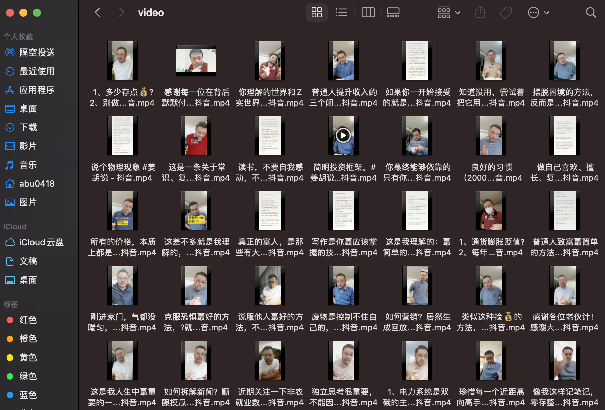
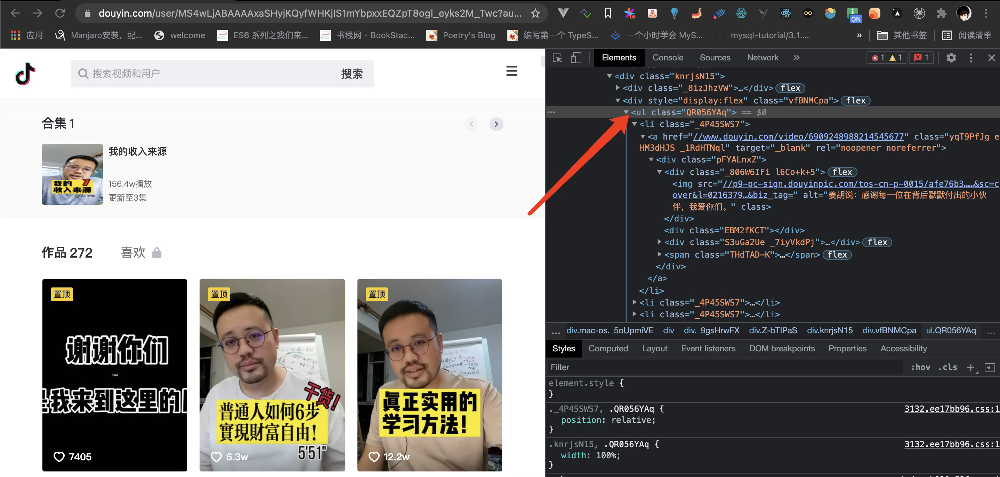

# 关于抖音视频爬虫

> 请勿用于商业



获取url链接

其实是有对应接口的，但是里面有个参数是加密，所以我就没有选择接口，直接滚动，复制ul里面所有内容到index.txt



然后使用正则转为test.json

## 爬虫核心代码

```py
response = requests.get(url=url, headers=headers)
title = re.findall('<title data-react-helmet="true">([\s\S]*)</title>', response.text)
href = re.findall('src(.*?)vr%3D%2', response.text)[1]
video_url = requests.utils.unquote(href).replace('":"', 'https:')

print(title)
print(video_url)

video_content = requests.get(url=video_url, headers=headers).content
with open('./video/' + title[0] +'.mp4', 'wb') as f:
  f.write(video_content)
```

这里记得替换headers

```sh
git github.com/douyin-request

python3 index.py
```

## 后期视频转文字

打算先转为音频，然后调别人接口转文字